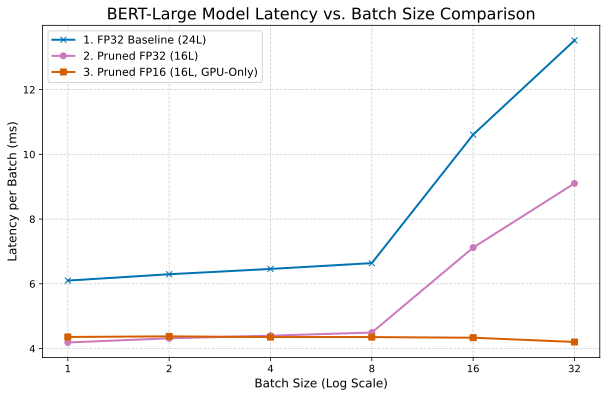

[English](README.md) | [中文](README_zh.md)

# Large Model Compression and Acceleration via Layer Pruning and Precision Quantization

  

## Table of Contents
- [Abstract](#abstract)
- [Key Techniques](#key-techniques)
- [Visualization of Results](#visualization-of-results)
- [Final Results](#final-results)
- [How to Reproduce](#how-to-reproduce)
- [Citation](#citation)
- [License](#license)

## Abstract

This project explores and implements a complete, end-to-end optimization pipeline for BERT-series models. The pipeline is **driven by layer sensitivity analysis** and systematically combines **structured pruning** with **multi-precision quantization** (including **FP16, INT8, and INT4**) to create high-performance models tailored for both GPU and CPU deployments. The goal is to strike the optimal balance between accuracy, latency, model size, and memory footprint.

Experiments were conducted on both `bert-base-uncased` and `bert-large-uncased` models, and comprehensively evaluated on the GLUE SST-2 task. Results reveal significant performance trade-offs:

* **For `bert-base`**: The combination of pruning and FP16 delivers an excellent trade-off between latency and compression on GPUs. On CPUs, the **Pruned + INT8** variant is optimal, reducing latency by **60%** ($167.87\text{ms} \to 67.02\text{ms}$) while maintaining high accuracy.
* **For `bert-large`**: The **Pruned + INT4** strategy achieved **95.8% model size reduction** ($3836.7\text{MB} \to 161.7\text{MB}$) and reduced peak GPU memory by **82.5%**, while even yielding a **+0.9% accuracy improvement** (up to `0.9404`). On CPUs, the **Pruned + INT8** variant reduced latency by **65.7%**.
* A key finding is that **INT4 quantization**, while offering unmatched compression and memory savings, currently suffers from **significantly higher inference latency on mainstream GPUs** compared to FP32/FP16, due to costly de-quantization overhead. This highlights the practical trade-off between extreme compression and real-world inference speed.

In summary, this project not only validates the significant potential of "Pruning + Quantization" strategies but also provides quantitative guidance for model selection across different deployment environments.

---

## Key Techniques

* **Model Sensitivity Analysis**: Systematic ablation to identify the least important Transformer layers.
* **Structured Pruning**: Physically removes redundant layers, directly reducing model depth and parameter count.
* **Re-finetuning**: Brief fine-tuning of pruned models to recover accuracy lost from structural changes.
* **Multi-Precision Quantization**:

  * **FP16 Half Precision**: Exploits GPU Tensor Cores for acceleration and reduced memory usage.
  * **INT8 (PTQ)**: Post-training quantization, particularly effective on CPUs for low-latency inference.
  * **INT4 (BitsAndBytes)**: Extreme compression for storage/memory-constrained applications.
* **Multi-Dimensional Evaluation**: Accuracy, latency, model size, and peak memory usage are compared holistically.

---

## Visualization of Results

#### Layer Sensitivity Analysis

*Left: BERT-Base (12 Layers). Right: BERT-Large (24 Layers).*

<p align="center">
  
  &nbsp;
  
</p>

#### Multi-Dimensional Radar Chart

> **On Normalization:** To visualize heterogeneous metrics in a single radar chart, all values are normalized into a $[0.1, 1]$ score range.
>
> * **Cost Metrics (Size, Latency, Memory):** Lower is better, so inverted normalization is used. Best = 1, Worst = 0.1.
>   $$\text{Score} = \alpha + (1 - \alpha) \times \frac{\max(X) - x}{\max(X) - \min(X)}$$
> * **Benefit Metrics (Accuracy):** Higher is better, normalized within a semantic range `[0.90, 0.94]` to highlight differences at the high-accuracy regime.
>   $$\text{Score} = \alpha + (1 - \alpha) \times \frac{x - \mathrm{semantic\_min}}{\mathrm{semantic\_max} - \mathrm{semantic\_min}}$$
> * The correction factor $\alpha$ is set to `0.1` to avoid zero values, improving visualization clarity.


---

## Final Results

#### BERT-Base (12 → 8 Layers)

| Model                     |  Size (MB) | Accuracy (GPU) | Latency (GPU, ms) | Peak GPU Mem (MB) | Accuracy (CPU) | Latency (CPU, ms) |
| :------------------------ | ---------: | :------------- | :---------------- | :---------------- | :------------- | :---------------- |
| Baseline (12L, FP32)      |    1253.16 | 0.9300         | 3.20              | 428.26            | 0.9300         | 167.87            |
| Baseline (12L, INT4)      |      91.64 | 0.9300         | 9.31              | 106.13            | N/A            | N/A               |
| Baseline (12L, PTQ INT8)  |     173.09 | N/A            | N/A               | N/A               | 0.9186         | 87.91             |
| Baseline (12L, QAT INT8)  |     418.63 | 0.9255         | 3.22              | 474.50            | 0.9255         | 145.98            |
| Pruned (8L, FP32)         |     310.42 | 0.9278         | 2.25              | 366.35            | 0.9278         | 107.95            |
| **Pruned (8L, FP16)** | **155.66** | **0.9266** | **2.27** | **213.82** | N/A            | N/A               |
| **Pruned (8L, INT4)** |  **74.78** | **0.9278** | 8.96              | **113.18** | N/A            | N/A               |
| **Pruned (8L, PTQ INT8)** | **145.90** | N/A            | N/A               | N/A               | **0.9232** | **67.02** |

**Analysis:**

* **CPU Deployment**: Pruned + PTQ INT8 achieved the best performance with `67.02ms` latency (23.8% faster than baseline INT8).
* **Compression**: Pruned + INT4 reduced size to **74.78MB (94% smaller)** without accuracy loss, though GPU latency increased (8.96ms).

---

#### BERT-Large (24 → 16 Layers)

| Model                      |  Size (MB) | Accuracy (GPU) | Latency (GPU, ms) | Peak GPU Mem (MB) | Accuracy (CPU) | Latency (CPU, ms) |
| :------------------------- | ---------: | :------------- | :---------------- | :---------------- | :------------- | :---------------- |
| Baseline (24L, FP32)       |    3836.70 | 0.9312         | 6.04              | 1288.91           | 0.9312         | 420.02            |
| Pruned (16L, FP32)         |     895.00 | 0.9392         | 4.14              | 904.51            | 0.9392         | 281.94            |
| **Pruned (16L, FP16)** | **447.97** | **0.9392** | **4.25** | **456.82** | N/A            | N/A               |
| **Pruned (16L, INT4)** | **161.70** | **0.9404** | 17.26             | **224.71** | N/A            | N/A               |
| **Pruned (16L, PTQ INT8)** | **315.24** | N/A            | N/A               | N/A               | **0.9140** | **144.11** |

**Analysis:**

* **Accuracy Gains**: Notably, Pruned + INT4 not only achieved **95.8% compression** but also improved accuracy (+0.9%), possibly due to quantization noise acting as regularization.
* **CPU Speedup**: Pruned + PTQ INT8 reduced CPU latency from `420.02ms` → `144.11ms` (**2.9× faster**).
* **Latency Trade-off**: On GPUs, INT4 suffered from high de-quantization overhead (17.26ms, ~4× slower than FP16).

---

#### Batch Size Effects on Latency

<p align="center">
  
  &nbsp;
  
</p>

**Observations:**

* **Pruning (FP32)**: Stable latency reduction across all batch sizes.
* **FP16**: Latency advantage only emerges at larger batch sizes (≥16), where Tensor Cores are fully utilized.
* **Notable Case**: Pruned FP16 latency even *decreased* at batch size 32–64, confirming GPU hardware optimization saturation.

---

## How to Reproduce

### 1. Environment

* **OS**: Linux
* **GPU**: NVIDIA RTX 5090 32GB
* **CUDA**: 12.8
* **Python**: 3.12
* **Core Libraries**: PyTorch 2.5.1+cu121, Transformers, Datasets, Optimum, BitsAndBytes

### 2. Setup

```bash
# 1. Clone repository
git clone [https://github.com/ManiaAmaeOvo/bert-layer-pruning-quantization/](https://github.com/ManiaAmaeOvo/bert-layer-pruning-quantization/)
cd bert-layer-pruning-quantization/

# 2. Create environment
conda create -n model_opt python=3.12 -y
conda activate model_opt

# 3. Install dependencies
pip install -r requirements.txt
````

### 3\. BERT-Base Workflow

1.  `bert_base_fine.ipynb` – Fine-tune baseline (`bert-base-uncased`) on SST-2.
2.  `base_ablation_study.ipynb` – Sensitivity analysis via layer ablation.
3.  `bert_base_pruned_fine.ipynb` – Prune & re-finetune.
4.  `base_pruned_fp16.ipynb` – Convert to FP16 and evaluate.
5.  `base_pruned_int4_bnb.ipynb`, etc. – Quantization (INT8/INT4).

### 4\. BERT-Large Workflow

1.  `bert_large_fine.ipynb` – Fine-tune baseline.
2.  `bert_large_ablation.ipynb` – Sensitivity analysis.
3.  `bert_large_fp16.ipynb` – Pruning + fine-tuning + FP16 conversion.
4.  `large_pruned_int4_bnb.ipynb`, etc. – Quantization.

### 5\. Evaluation

  * `eva/showdown.py` – Generates the final results table for the BERT-Base series.
  * `eva/showdown_large.py` – Generates the final results table for the BERT-Large series.
  * `eva/radar.ipynb` – Normalizes data and plots the performance radar charts.

-----

## Citation

```bibtex
@misc{yang2025bertprune,
  author       = {Yang, Rui},
  title        = {BERT Layer Pruning & Quantization (Undergrad Thesis)},
  year         = {2025},
  publisher    = {GitHub},
  journal      = {GitHub repository (Thesis Project)},
  howpublished = {\url{[https://github.com/ManiaAmaeOvo/bert-layer-pruning-quantization](https://github.com/ManiaAmaeOvo/bert-layer-pruning-quantization)}}
}
```

-----

## License

This project is released under the [MIT License](https://www.google.com/search?q=LICENSE).

```