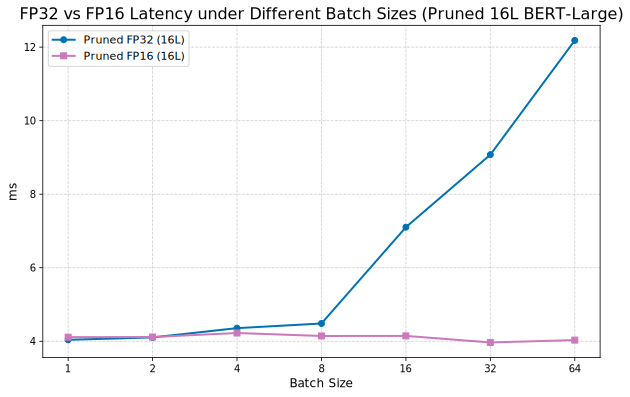

[English](README.md) | [中文](README_zh.md)

# Large Model Compression and Acceleration via Layer Pruning and Precision Quantization


## Abstract

This project explores and implements a complete, end-to-end optimization pipeline for BERT-series models. Driven by **layer sensitivity analysis**, this pipeline combines **structured pruning** and **FP16 half-precision conversion** to create high-performance models for modern high-end GPUs, achieving an optimal balance between accuracy, latency, model size, and memory footprint.

Experiments were conducted on both `bert-base-uncased` and `bert-large-uncased` models and comprehensively evaluated on the GLUE SST-2 sentiment analysis task. The results demonstrate that the proposed "Pruning + FP16" strategy, especially on large models like `bert-large`, can achieve **over 88% model compression** (*3836.7MB->447.97MB*)and **significant performance acceleration** (*6.00ms -> 4.17ms* Even better on larger batch_size)with **negligible or even improved accuracy** , proving the effectiveness and superiority of the methodology.

## Key Techniques
* **Sensitivity Analysis**: Precisely identifies the least important Transformer layers via layer-by-layer ablation studies.
* **Structured Pruning**: Physically removes redundant layers based on sensitivity scores, directly reducing model depth and parameter count.
* **Re-finetuning**: Briefly fine-tunes the pruned model to recover accuracy lost due to structural changes.
* **FP16 Half-Precision Conversion**: Leverages modern GPU Tensor Cores to accelerate inference and reduce memory usage.
* **Multi-Dimensional Evaluation**: Conducts a comprehensive showdown of all models across metrics like accuracy, latency, size, and peak memory usage.

## Visualization of Results

#### Layer Sensitivity Analysis
*Left: BERT-Base (12 Layers). Right: BERT-Large (24 Layers).*
<p align="center">
  
  &nbsp;
  
</p>

#### FP16 vs. FP32 Latency Under Different Batch Sizes
*Left: Pruned BERT-Base (8 Layers). Right: Pruned BERT-Large (16 Layers).*
<p align="center">
  
  &nbsp;
  
</p>

#### Multi-Dimensional Performance Radar Chart

> **Note on Normalization:** To visualize these diverse metrics on a single radar chart, we normalized all data into a unified score ranging from $[0.1, 1]$.
>
>   * **Cost Indicators (Size, Latency, Memory):** Metrics where lower is better are inverted and normalized. The best-performing model (lowest value) gets a score of 1, and the worst gets 0.1. The formula is:
>     $$\text{Score} = \alpha + (1 - \alpha) \times \frac{\max(X) - x}{\max(X) - \min(X)}$$
>   * **Benefit Indicators (Accuracy):** Metrics where higher is better are normalized directly. To better reflect performance in the high-accuracy range, we mapped accuracy to a fixed semantic range of `[0.90, 0.94]`. The formula is:
>     $$\text{Score} = \alpha + (1 - \alpha) \times \frac{x - \text{semantic\_min}}{\text{semantic\_max} - \text{semantic\_min}}$$
>   * The coefficient $\\alpha$ is set to `0.1` to prevent any score from being zero, ensuring better visibility on the chart.
>   * After this processing, all the values become **the larger, the better**, which makes the radar chart more intuitive to interpret.


## Final Results

#### Bert-Base (12L -> 8L) Optimization Results
| Model                                |   Size (MB) | Accuracy (GPU)   | Latency (GPU, ms)   | Peak GPU Mem (MB)   | Accuracy (CPU)   | Latency (CPU, ms)   |
|:-------------------------------------|------------:|:-----------------|:--------------------|:--------------------|:-----------------|:--------------------|
| 1. FP32 Baseline (12L)               |     1253.16 | 0.9300           | 3.23                | 428.26              | 0.9300           | 127.99              |
| 2. INT4 BitsAndBytes (12L, GPU-Only) |       91.64 | 0.9300           | 8.92                | 106.13              | N/A              | N/A                 |
| 3. INT8 PTQ (12L, CPU-Only)          |      173.09 | N/A              | N/A                 | N/A                 | 0.9186           | 67.03               |
| 4. INT8 QAT (12L)                    |      418.63 | 0.9255           | 3.22                | 428.56              | 0.9255           | 132.04              |
| 5. Pruned FP32 (8L)                  |      310.42 | 0.9278           | 2.30                | 320.98              | 0.9278           | 114.94              |
| **6. Pruned FP16 (8L, GPU-Only)** |      **155.66** | **0.9266** | **2.28** | **169.25** | **N/A** | **N/A** |

#### Bert-Large (24L -> 16L) Optimization Results
| Model                                       |   Size (MB) |   Accuracy (GPU) |   Latency (GPU, ms) |   Peak GPU Mem (MB) | Accuracy (CPU)   | Latency (CPU, ms)   |
|:--------------------------------------------|------------:|-----------------:|--------------------:|--------------------:|:-----------------|:--------------------|
| 1. Baseline (bert-large, 24L, FP32)         |     3836.7  |           0.9312 |                6.00 |             1288.91 | 0.9312           | 383.98              |
| 2. Pruned (bert-large, 16L, FP32)           |      895.00 |           **0.9392** |                4.14 |              904.51 | **0.9392** | 288.00              |
| **3. Pruned+Quantized (bert-large, 16L, FP16)** |      **447.97** |           **0.9392** |                **4.17** |              **456.82** | **N/A** | **N/A** |

*Analysis: On `bert-large`, our optimization strategy is even more impressive. Pruning not only reduced the size but also **improved accuracy by 0.8%**, likely due to a regularization effect. The final `Pruned+FP16` model achieved an **88% size compression**, **65% memory reduction**, and **30% latency reduction** compared to the original `bert-large` baseline, all while achieving higher accuracy.*

## How to Reproduce

### 1. Experiment Environment
The results were reproduced in the following environment:
* **OS**: Linux
* **GPU**: NVIDIA RTX 5090 32GB
* **CUDA**: 12.8
* **Python**: 3.12
* **Key Libraries**: PyTorch 2.5.1+cu121, Transformers, Datasets, Optimum

### 2. Setup
First, clone the repository and create a clean Python environment using Conda.
```bash
# 1. Clone the repository
git clone <your-repo-url>
cd <your-repo-name>

# 2. Create and activate a Conda environment
conda create -n model_opt python=3.12 -y
conda activate model_opt

# 3. Install dependencies
pip install -r requirements.txt
```

### 3. Workflow for `bert-base`
Execute the Jupyter Notebooks in the `bert_base/` directory in the following order.

> **Important Note:** Before running each notebook, please check and modify the model input/output paths at the beginning of the file to match your directory structure.

1.  `bert_base_fine.ipynb` - **Fine-tune Baseline**: Fine-tunes the standard `bert-base-uncased` on SST-2 to generate the base model for all subsequent optimizations.
2.  `base_ablation_study.ipynb` - **Sensitivity Analysis**: Loads the fine-tuned model and performs an ablation study to generate layer sensitivity scores.
3.  `bert_base_pruned_fine.ipynb` - **Pruning & Re-finetuning**: Removes the least important layers and re-finetunes the pruned model to recover accuracy.
4.  `base_pruned_fp16.ipynb` - **FP16 Conversion & Test**: Converts the pruned model to FP16 and runs a performance comparison.

### 4. Workflow for `bert-large`
Similarly, execute the notebooks in the `bert_large/` directory.

> **Important Note:** Please verify and update the model paths in each notebook before running.

1.  `bert_large_fine.ipynb` - **Fine-tune Baseline**: Fine-tunes the `bert-large-uncased` model.
2.  `bert_large_ablation.ipynb` - **Sensitivity Analysis**: Performs sensitivity analysis on the fine-tuned `bert-large` model.
3.  `bert_large_fp16.ipynb` - **Pruning, Re-finetuning & FP16 Conversion**: An integrated notebook for the entire optimization pipeline on `bert-large`.

### 5. Final Evaluation
The scripts in the `eva/` directory generate the final comparison reports.

1.  `shoudown.py` - Generates the final comparison table for the `bert-base` series (`final_results.md`).
2.  `showdown_large.py` - Generates the final comparison table for the `bert-large` series (`final_results_bert_large.md`).
3.  `radar.ipynb` - Loads the final evaluation data, normalizes it, and plots the performance radar chart.

> **Important Note:** Before running the evaluation scripts, ensure the `MODELS_TO_EVALUATE` list in each script correctly points to your generated model artifacts.

## Citation
If this work is useful for your research, please consider citing it as follows:

```bibtex
@misc{yang2025bertlayerpruning,
  author       = {Yang, Rui},
  title        = {BERT Layer Pruning and Quantization},
  year         = {2025},
  publisher    = {GitHub},
  journal      = {GitHub repository},
  howpublished = {\url{https://github.com/ManiaAmaeOvo/bert-layer-pruning-quantization}}
}
```
## License
This project is licensed under the [MIT License](LICENSE).
