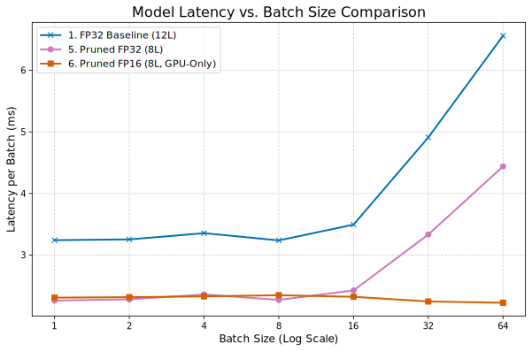
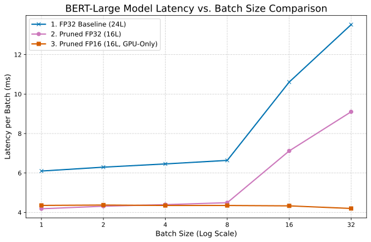

[English](README.md) | [中文](README_zh.md)

# 基于层裁剪与精度量化的大模型压缩与加速方法


## 摘要

本项目探索并实现了一套完整的、针对BERT系列模型的端到端优化管线。该管线以**层敏感度分析**为核心驱动，系统性地结合了**结构化剪枝**与包括**FP16、INT8、INT4在内的多精度量化**技术，旨在为现代硬件（GPU/CPU）打造在精度、延迟、模型体积和显存占用之间达到最佳平衡的高性能模型。

实验分别在`bert-base-uncased`和`bert-large-uncased`模型上进行，并在GLUE SST-2任务上进行了全面评估。结果揭示了深刻的性能权衡：

* **在 `bert-base` 模型上**，本管线展示了清晰的梯度优化效果。`剪枝+FP16`策略为GPU端提供了延迟和压缩的绝佳平衡点。而对于CPU部署，`剪枝+INT8量化`组合成为最优选择，**延迟降低了60%**（$167.87\text{ms} \to 67.02\text{ms}$），同时保持了很高的精度。

* **在 `bert-large` 模型上**，该优化策略的效果更为惊人。`剪枝+INT4量化`的极限压缩策略，实现了**高达95.8%的模型压缩**（$3836.7\text{MB} \to 161.7\text{MB}$），并将**峰值显存降低了82.5%**，同时**精度甚至获得了0.9%的意外提升**，达到了惊人的 `0.9404`。同样，其`剪枝+INT8`版本在CPU上的**延迟也降低了65.7%**。

* 研究同时揭示了一个关键的权衡：`INT4` 量化虽然在压缩和显存占用上无与伦比，但在当前主流GPU硬件和库的实现下，其**推理延迟显著高于FP32/FP16版本**。这揭示了在选择优化策略时，极致压缩与计算延迟之间的重要矛盾，证明了为不同硬件和应用场景选择合适策略的必要性。

综上，本项目不仅验证了“剪枝+量化”策略的巨大潜力，也为不同部署场景下的模型选型提供了精确、量化的决策依据。

## 核心技术
* **模型敏感度分析 (Sensitivity Analysis)**: 通过逐层消融（Ablation Study）精确定位对任务贡献度最低的Transformer层。
* **结构化剪枝 (Structured Pruning)**: 根据敏感度得分，物理移除冗余的模型层，直接减小模型深度和参数量。
* **重新微调 (Re-finetuning)**: 对剪枝后的模型进行短暂的微调，以恢复因结构改变而损失的精度。
* **多精度量化 (Multi-Precision Quantization)**:
    * **FP16 半精度**: 利用现代GPU的Tensor Core实现推理加速和显存节省。
    * **INT8 (PTQ)**: 针对CPU进行训练后量化（Post-Training Quantization），大幅提升CPU推理速度。
    * **INT4 (BitsAndBytes)**: 实现极致的模型体积压缩，探索压缩率的极限。
* **多维度性能评估**: 从精度、延迟、模型大小、峰值显存等多个指标，对所有模型进行综合“对决”。

## 可视化成果

#### 层敏感度分析
*左: BERT-Base (12层). 右: BERT-Large (24层).*
<p align="center">
  
  &nbsp;
  
</p>


#### 多维度性能雷达图

> **关于归一化方法**：为了在同一视图下直观对比多个异构指标，我们将所有数据归一化到一个统一的 $[0.1, 1]$ 评分区间。
>
>   * **成本型指标 (模型尺寸, 延迟, 峰值内存)**：数值越小越好的指标，我们进行逆向归一化处理。表现最佳（值最小）的模型得分为1，最差的为0.1。公式如下：
>     $$\text{Score} = \alpha + (1 - \alpha) \times \frac{\max(X) - x}{\max(X) - \min(X)}$$
>   * **效益型指标 (准确率)**：数值越大越好的指标，我们进行正向归一化。特别地，为更真实反映高精度区间的性能差异，我们设定了一个固定的语义范围 `[0.90, 0.94]` 进行映射。公式如下：
>      $$\text{Score} = \alpha + (1 - \alpha) \times \frac{x - \mathrm{semantic\_min}}{\mathrm{semantic\_max} - \mathrm{semantic\_min}}$$
>   * 修正系数 $\\alpha$ 设为 `0.1`，以避免归一化后的最小值为0，使可视化结果更清晰。
>   * 经此处理，所有的数值都变成了**越大越好**，这样在雷达图上看起来会更加直观。


## 最终实验结果

#### Bert-Base (12层 -> 8层) 优化结果

| Model | Size (MB) | Accuracy (GPU) | Latency (GPU, ms) | Peak GPU Mem (MB) | Accuracy (CPU) | Latency (CPU, ms) |
|:---|---:|:---|:---|:---|:---|:---|
| 1. Baseline (12L, FP32) | 1253.16 | 0.9300 | 3.20 | 428.26 | 0.9300 | 167.87 |
| 2. Baseline (12L, INT4) | 91.64 | 0.9300 | 9.31 | 106.13 | N/A | N/A |
| 3. Baseline (12L, PTQ INT8) | 173.09 | N/A | N/A | N/A | 0.9186 | 87.91 |
| 4. Baseline (12L, QAT INT8) | 418.63 | 0.9255 | 3.22 | 474.50 | 0.9255 | 145.98 |
| 5. Pruned (8L, FP32) | 310.42 | 0.9278 | 2.25 | 366.35 | 0.9278 | 107.95 |
| **6. Pruned (8L, FP16)** | **155.66** | **0.9266** | **2.27** | **213.82** |**N/A** | **N/A** |
| **7. Pruned (8L, INT4)** | **74.78** | **0.9278** | 8.96 | **113.18** | **N/A** | **N/A** |
| **8. Pruned (8L, PTQ INT8)** | **145.90** | **N/A** | **N/A** | **N/A** | **0.9232** | **67.02** |

* **`bert-base` 结果分析**: 剪枝与量化策略的结合在 `bert-base` 模型上表现出显著的协同效应。
    * **CPU推理性能**: 对于CPU部署场景，`Pruned + PTQ INT8` 模型展现出最优性能。其 `67.02ms` 的延迟不仅在所有变体中最低，且相较于未剪枝的INT8基线模型（`87.91ms`），性能提升了 **23.8%**。这表明层剪枝与INT8量化之间存在积极的相互作用，共同提升了最终的执行效率。
    * **模型压缩率**: `Pruned + INT4` 模型实现了最高的压缩率，模型体积仅为 **74.78MB**（压缩率94%），并且未造成任何精度损失。然而，其较高的GPU推理延迟（`8.96ms`）表明，该策略更适用于存储或内存资源受限、但对实时性要求不高的应用场景。

#### Bert-Large (24层 -\> 16层) 优化结果

| Model | Size (MB) | Accuracy (GPU) | Latency (GPU, ms) | Peak GPU Mem (MB) | Accuracy (CPU) | Latency (CPU, ms) |
|:---|---:|:---|:---|:---|:---|:---|
| 1. Baseline (24L, FP32) | 3836.70 | 0.9312 | 6.04 | 1288.91 | 0.9312 | 420.02 |
| 2. Pruned (16L, FP32) | 895.00 | 0.9392 | 4.14 | 904.51 | 0.9392 | 281.94 |
| **3. Pruned (16L, FP16)** | **447.97** | **0.9392** | **4.25** | **456.82** | **N/A** | **N/A** |
| **4. Pruned (16L, INT4)** | **161.70** | **0.9404** | 17.26 | **224.71** | **N/A** | **N/A** |
| **5. Pruned (16L, PTQ INT8)** | **315.24** | **N/A** | **N/A** | **N/A** | **0.9140** | **144.11** |

* **`bert-large` 结果分析**: 在 `bert-large` 模型上，本优化管线的有效性得到进一步验证，同时也揭示了更深层次的性能权衡。
    * **精度与压缩的意外增益**: `Pruned + INT4` 模型产生了一个值得关注的反直觉结果：它不仅实现了 **95.8%** 的极致压缩率，其准确率也提升至 `0.9404`，为所有模型中的最高值。对此现象的一个可能解释是，INT4量化引入的噪声可能在剪枝后的模型上起到了正则化（Regularization）的作用，从而提升了模型的泛化能力。
    * **CPU推理加速**: `Pruned + PTQ INT8` 模型再次确立了其在CPU环境下的优势。延迟从基线的 `420.02ms` 降低至 `144.11ms`，获得了 **2.9倍** 的加速比，是面向CPU部署任务的理想配置。
    * **INT4量化的延迟开销**: 一个关键的性能权衡体现在GPU端。`Pruned + INT4` 模型的推理延迟（`17.26ms`）显著高于其他GPU模型，约为剪枝后FP32/FP16版本的4倍。该结果表明，在当前测试的硬件与软件库组合下，INT4在计算过程中产生的反量化（de-quantization）开销，超过了因模型尺寸减小所带来的I/O或带宽优势。


#### 不同批量下的FP16与剪枝前后的FP32延迟对比

*初步观察发现，在小批量推理时，优化后模型的延迟（Latency）优势似乎并不显著。我们推断这可能是由于在小批量下，数据IO和GPU Kernel启动的固定开销（Overhead）掩盖了模型计算本身的增益。为了验证这一假设并更全面地评估模型性能，我们进行了一系列跨不同批量大小的延迟对比实验。*

<p align="center">
  
  &nbsp;
  
</p>

* **分析**：实验结果清晰地表明，不同优化策略的延迟优势与批量大小密切相关。
    * **层剪枝 (Pruned FP32 vs Baseline FP32)**：层剪枝的效果在**所有批量大小下都是稳定且显著的**，直接反映了计算量的减少带来了延迟的稳定降低。
    * **FP16量化 (Pruned FP16 vs Pruned FP32)**：FP16量化的优势在**大批量时才完全体现**。在小批量（1-8）时，其延迟与FP32模型相近；但随着批量增大（16-64），FP16能更充分地利用GPU的Tensor Core进行并行计算，性能优势愈发明显，与FP32模型的差距显著拉开。
    * **值得注意的现象**：`Pruned FP16` 模型在批量大小为32和64时，其绝对延迟**不升反降**。这有力地证明了，只有当计算负载足够大时，GPU针对FP16的硬件优化单元才能被完全“唤醒”和饱和，从而以极高的效率完成计算任务。

## 如何复现

### 1. 实验环境
本项目结果在以下环境中复现：
* **操作系统**: Linux
* **GPU**: NVIDIA RTX 5090 32GB
* **CUDA**: 12.8
* **Python**: 3.12
* **核心库**: PyTorch 2.5.1+cu121, Transformers, Datasets, Optimum, BitsAndBytes

### 2. 环境配置
首先，克隆本仓库，并建议使用Conda创建一个干净的Python 3.12+环境。
```bash
# 1. 克隆仓库
git clone https://github.com/ManiaAmaeOvo/bert-layer-pruning-quantization/
cd https://github.com/ManiaAmaeOvo/bert-layer-pruning-quantization/

# 2. 创建并激活Conda环境
conda create -n model_opt python=3.12 -y
conda activate model_opt

# 3. 安装依赖
pip install -r requirements.txt
```

### 3. Bert-Base 实验流程
请按以下顺序，依次执行`bert_base`目录下的Jupyter Notebooks。

> **重要提示**: 在运行每个Notebook之前，请检查并修改文件头部的**模型输入/输出路径**，确保它们指向正确的位置。

1.  `bert_base_fine.ipynb` - **微调Baseline**: 对标准的`bert-base-uncased`模型在SST-2上进行微调，生成后续所有优化的基础模型。
2.  `base_ablation_study.ipynb` - **敏感度分析**: 加载上一步微调好的模型，进行逐层消融实验，生成层敏感度分数和可视化图表。
3.  `bert_base_pruned_fine.ipynb` - **剪枝与重训练**: 根据敏感度分析的结果，移除最不重要的层，并对剪枝后的模型进行重新微调以恢复精度。
4.  `base_pruned_fp16.ipynb` - **FP16转换与评估**: 将剪枝并微调好的模型转换为FP16半精度，并进行性能对比测试。
5.  `base_pruned_int4_bnb.ipynb`等 - **INT精度量化**: 进行对应精度的量化并保存模型

### 4. Bert-Large 实验流程
与Bert-Base流程类似，请依次执行`bert_large`目录下的Jupyter Notebooks。

> **重要提示**: 同样，请在运行前检查并修改每个Notebook中的**模型路径**。

1.  `bert_large_fine.ipynb` - **微调Baseline**: 对`bert-large-uncased`模型进行微调。
2.  `bert_large_ablation.ipynb` - **敏感度分析**: 对微调好的`bert-large`模型进行敏感度分析。
3.  `bert_large_fp16.ipynb` - **剪枝、重训练与FP16转换**: 这个Notebook整合了剪枝、重新微调和FP16转换的完整流程。
4.  `large_pruned_int4_bnb.ipynb`等 - **INT精度量化**: 进行对应精度的量化并保存模型

### 5. 最终评估
`eva`目录包含了生成最终对比报告的脚本。

1.  `showdown.py` - 用于生成`bert-base`系列的最终对比总表 (`final_results_all_bert_base_models.md`)。
2.  `showdown_large.py` - 用于生成`bert-large`系列的最终对比总表 (`final_results_bert_large_series.md`)。
3.  `radar.ipynb` - 加载最终的评估数据，进行归一化处理，并绘制最终的性能雷达图。

> **重要提示**: 在运行评估脚本前，请确保`MODELS_TO_EVALUATE`列表中每个模型的`path`都指向您自己生成的、正确的模型文件目录。

## 引用
如果您的研究从本项目中获益，请考虑以下方式引用。
```bibtex
@misc{yang2025bertprune,      % Key: 自定义唯一标识
  author       = {Yang, Rui},  % 作者
  title        = {BERT Layer Pruning & Quantization (Undergrad Thesis)}, % 项目/论文标题
  year         = {2025},       % 发布年份
  publisher    = {GitHub},     % 发布平台
  journal      = {GitHub repository (Thesis Project)}, % 类型说明
  howpublished = {\url{https://github.com/ManiaAmaeOvo/bert-layer-pruning-quantization}} % 仓库 URL
}

```

## 许可证 (License)
本项目采用 [MIT License](LICENSE)。