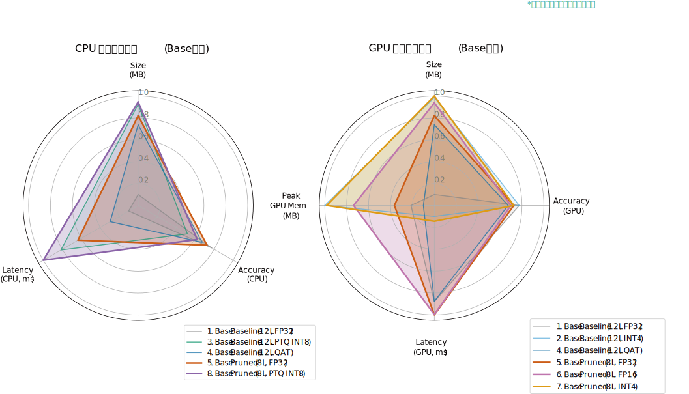

[English](README.md) | [中文](README_zh.md)

# 基于层裁剪与精度量化的大模型压缩与加速方法


## 摘要

本项目探索并实现了一套完整的、针对BERT系列模型的端到端优化管线。该管线以**层敏感度分析**为核心驱动，结合了**结构化剪枝**与**FP16半精度转换**两种优化技术，旨在为现代高端GPU打造在精度、延迟、模型体积和显存占用之间达到最佳平衡的高性能模型。

实验分别在`bert-base-uncased`和`bert-large-uncased`模型上进行，并在GLUE SST-2任务上进行了全面评估。结果表明，本管线提出的“剪枝+FP16”策略，尤其是在`bert-large`这样的大模型上，能够实现**超过88%的模型压缩**(*3836.7MB->447.97MB*)和**显著的性能加速**(*6.00ms -> 4.17ms* 在更大的batch_size上甚至更好)，同时**精度几乎无损，甚至略有提升**，证明了该方法的有效性和优越性。

## 核心技术
* **模型敏感度分析 (Sensitivity Analysis)**: 通过逐层消融（Ablation Study）精确定位对任务贡献度最低的Transformer层。
* **结构化剪枝 (Structured Pruning)**: 根据敏感度得分，物理移除冗余的模型层，直接减小模型深度和参数量。
* **重新微调 (Re-finetuning)**: 对剪枝后的模型进行短暂的微调，以恢复因结构改变而损失的精度。
* **半精度转换 (FP16 Conversion)**: 利用现代GPU的Tensor Core硬件，将模型转换为FP16半精度，实现推理加速和显存节省。
* **多维度性能评估**: 从精度、延迟、模型大小、峰值显存等多个指标，对所有模型进行综合“对决”。

## 可视化成果

#### 层敏感度分析
*左: BERT-Base (12层). 右: BERT-Large (24层).*
<p align="center">
  
  &nbsp;
  
</p>

#### 不同批量下的FP16与FP32延迟对比
*左: 剪枝后 BERT-Base (8层). 右: 剪枝后 BERT-Large (16层).*
<p align="center">
  
  &nbsp;
  
</p>

#### 多维度性能雷达图

> **关于归一化方法**：为了在同一视图下直观对比多个异构指标，我们将所有数据归一化到一个统一的 $[0.1, 1]$ 评分区间。
>
>   * **成本型指标 (模型尺寸, 延迟, 峰值内存)**：数值越小越好的指标，我们进行逆向归一化处理。表现最佳（值最小）的模型得分为1，最差的为0.1。公式如下：
>     $$\text{Score} = \alpha + (1 - \alpha) \times \frac{\max(X) - x}{\max(X) - \min(X)}$$
>   * **效益型指标 (准确率)**：数值越大越好的指标，我们进行正向归一化。特别地，为更真实反映高精度区间的性能差异，我们设定了一个固定的语义范围 `[0.90, 0.94]` 进行映射。公式如下：
>      $$\text{Score} = \alpha + (1 - \alpha) \times \frac{x - \mathrm{semantic\_min}}{\mathrm{semantic\_max} - \mathrm{semantic\_min}}$$
>   * 修正系数 $\\alpha$ 设为 `0.1`，以避免归一化后的最小值为0，使可视化结果更清晰。
>   * 经此处理，所有的数值都变成了**越大越好**，这样在雷达图上看起来会更加直观。



## 最终实验结果

#### Bert-Base (12层 -> 8层) 优化结果
| Model                                |   Size (MB) | Accuracy (GPU)   | Latency (GPU, ms)   | Peak GPU Mem (MB)   | Accuracy (CPU)   | Latency (CPU, ms)   |
|:-------------------------------------|------------:|:-----------------|:--------------------|:--------------------|:-----------------|:--------------------|
| 1. FP32 Baseline (12L)               |     1253.16 | 0.9300           | 3.23                | 428.26              | 0.9300           | 127.99              |
| 2. INT4 BitsAndBytes (12L, GPU-Only) |       91.64 | 0.9300           | 8.92                | 106.13              | N/A              | N/A                 |
| 3. INT8 PTQ (12L, CPU-Only)          |      173.09 | N/A              | N/A                 | N/A                 | 0.9186           | 67.03               |
| 4. INT8 QAT (12L)                    |      418.63 | 0.9255           | 3.22                | 428.56              | 0.9255           | 132.04              |
| 5. Pruned FP32 (8L)                  |      310.42 | 0.9278           | 2.30                | 320.98              | 0.9278           | 114.94              |
| **6. Pruned FP16 (8L, GPU-Only)** |      **155.66** | **0.9266** | **2.28** | **169.25** | **N/A** | **N/A** |

#### Bert-Large (24层 -> 16层) 优化结果
| Model                                       |   Size (MB) |   Accuracy (GPU) |   Latency (GPU, ms) |   Peak GPU Mem (MB) | Accuracy (CPU)   | Latency (CPU, ms)   |
|:--------------------------------------------|------------:|-----------------:|--------------------:|--------------------:|:-----------------|:--------------------|
| 1. Baseline (bert-large, 24L, FP32)         |     3836.7  |           0.9312 |                6.00 |             1288.91 | 0.9312           | 383.98              |
| 2. Pruned (bert-large, 16L, FP32)           |      895.00 |           **0.9392** |                4.14 |              904.51 | **0.9392** | 288.00              |
| **3. Pruned+Quantized (bert-large, 16L, FP16)** |      **447.97** |           **0.9392** |                **4.17** |              **456.82** | **N/A** | **N/A** |

*分析：在`bert-large`上，本项目的优化策略效果更为惊人。剪枝不仅没有降低精度，反而**提升了0.8%**，这可能是因为移除了冗余层，起到了正则化的效果。最终的`剪枝+FP16`模型，相比原始`bert-large`，**体积压缩了88%**，**显存减少了65%**，**延迟降低了30%**，同时**精度更高**，展现了无与伦比的综合性能。*

## 如何复现

### 1. 实验环境
本项目结果在以下环境中复现：
* **操作系统**: Linux
* **GPU**: NVIDIA RTX 5090 32GB
* **CUDA**: 12.8
* **Python**: 3.12
* **核心库**: PyTorch 2.5.1+cu121, Transformers, Datasets, Optimum

### 2. 环境配置
首先，克隆本仓库，并建议使用Conda创建一个干净的Python 3.10+环境。
```bash
# 1. 克隆仓库
git clone <your-repo-url>
cd <your-repo-name>

# 2. 创建并激活Conda环境
conda create -n model_opt python=3.12 -y
conda activate model_opt

# 3. 安装依赖
pip install -r requirements.txt
```

### 3. Bert-Base 实验流程
请按以下顺序，依次执行`bert_base`目录下的Jupyter Notebooks。

> **重要提示**: 在运行每个Notebook之前，请检查并修改文件头部的**模型输入/输出路径**，确保它们指向正确的位置。

1.  `bert_base_fine.ipynb` - **微调Baseline**: 对标准的`bert-base-uncased`模型在SST-2上进行微调，生成后续所有优化的基础模型。
2.  `base_ablation_study.ipynb` - **敏感度分析**: 加载上一步微调好的模型，进行逐层消融实验，生成层敏感度分数和可视化图表。
3.  `bert_base_pruned_fine.ipynb` - **剪枝与重训练**: 根据敏感度分析的结果，移除最不重要的层，并对剪枝后的模型进行重新微调以恢复精度。
4.  `base_pruned_fp16.ipynb` - **FP16转换与评估**: 将剪枝并微调好的模型转换为FP16半精度，并进行性能对比测试。

### 4. Bert-Large 实验流程
与Bert-Base流程类似，请依次执行`bert_large`目录下的Jupyter Notebooks。

> **重要提示**: 同样，请在运行前检查并修改每个Notebook中的**模型路径**。

1.  `bert_large_fine.ipynb` - **微调Baseline**: 对`bert-large-uncased`模型进行微调。
2.  `bert_large_ablation.ipynb` - **敏感度分析**: 对微调好的`bert-large`模型进行敏感度分析。
3.  `bert_large_fp16.ipynb` - **剪枝、重训练与FP16转换**: 这个Notebook整合了剪枝、重新微调和FP16转换的完整流程。

### 5. 最终评估
`eva`目录包含了生成最终对比报告的脚本。

1.  `shoudown.py` - 用于生成`bert-base`系列的最终对比总表 (`final_results.md`)。
2.  `showdown_large.py` - 用于生成`bert-large`系列的最终对比总表 (`final_results_bert_large.md`)。
3.  `radar.ipynb` - 加载最终的评估数据，进行归一化处理，并绘制最终的性能雷达图。

> **重要提示**: 在运行评估脚本前，请确保`MODELS_TO_EVALUATE`列表中每个模型的`path`都指向您自己生成的、正确的模型文件目录。

## 引用
如果您的研究从本项目中获益，请考虑以下方式引用。
```bibtex
@misc{yang2025bertlayerpruning,
  author       = {Yang, Rui},
  title        = {BERT Layer Pruning and Quantization},
  year         = {2025},
  publisher    = {GitHub},
  journal      = {GitHub repository},
  howpublished = {\url{https://github.com/ManiaAmaeOvo/bert-layer-pruning-quantization}}
}
```

## 许可证 (License)
本项目采用 [MIT License](LICENSE)。